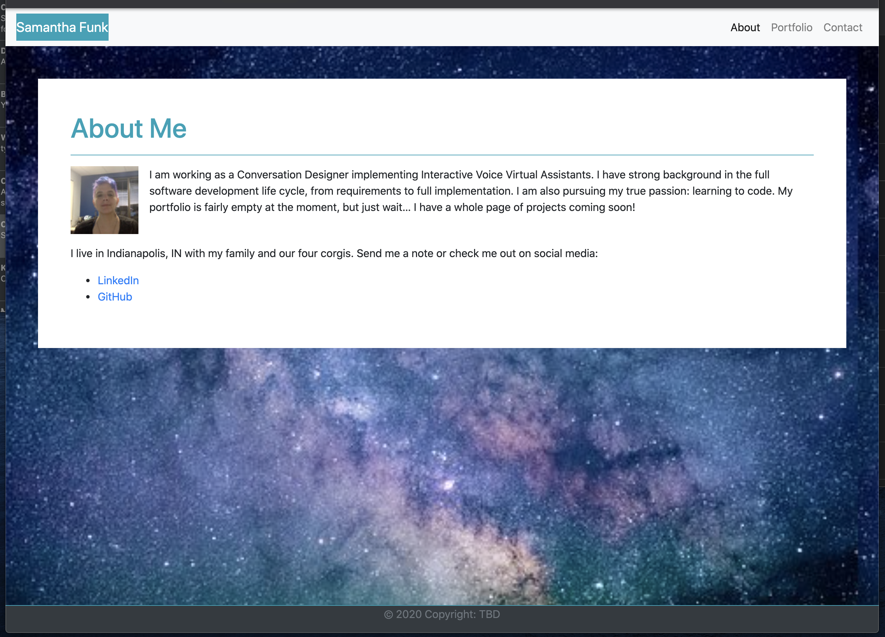
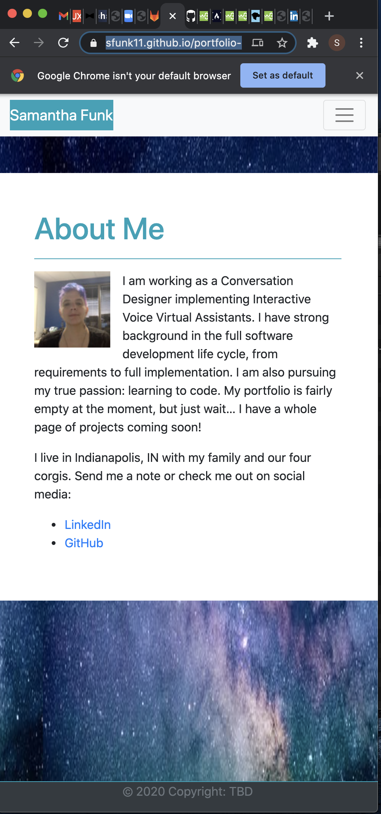
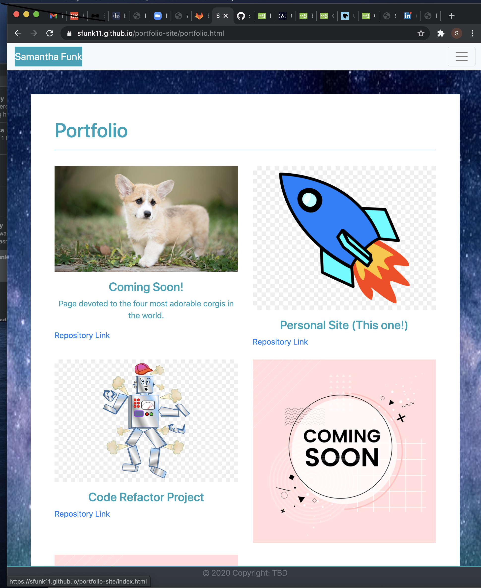
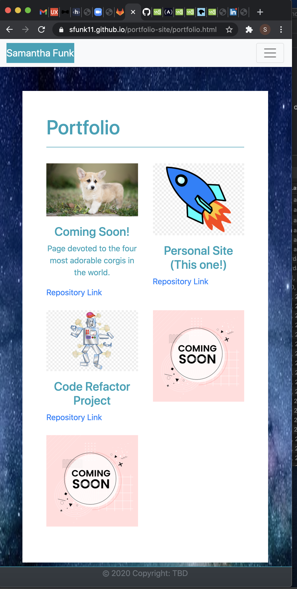
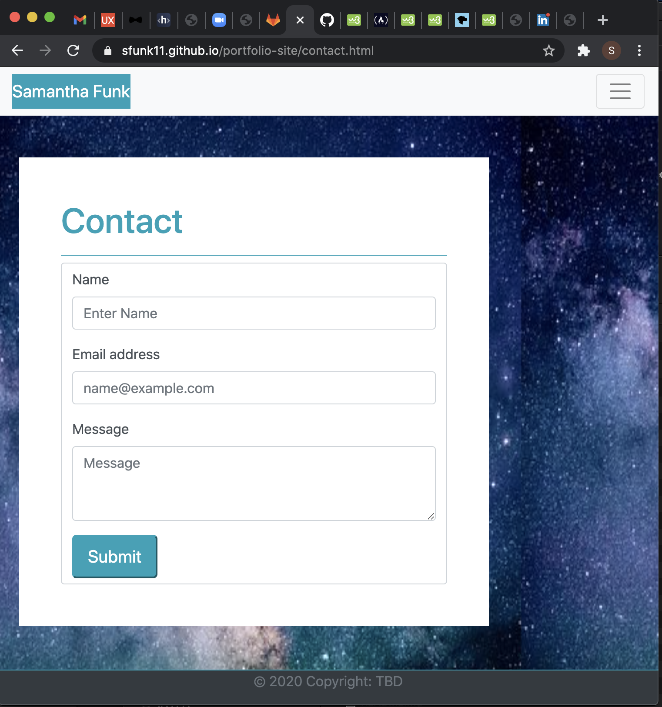
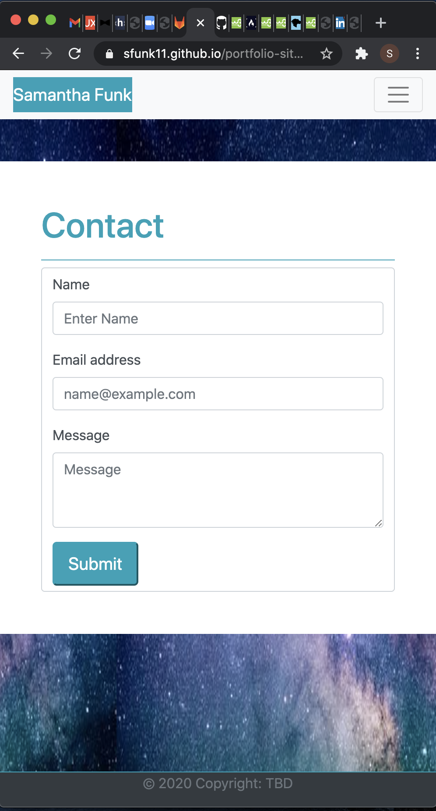

# About Me / Portfolio Site
Initial Version

## Description

This project involved building the front end of a personal portfolio site using Bootstrap 4 to style it. The styling is responsive to different viewport sizes. There are three pages: "About Me", "Portfolio",  and a "Contact" form. All three share a uniform style and you can navigate between the pages using the navigation menu.  Because this is front end only,  the contact form does not actually save or send information when submitted, but all of the other links are operational.

[Deployed Site](https://sfunk11.github.io/portfolio-site/)

## Details

### The "About Me page"

This page contains links to LinkedIn and Github,  as well as links to the other pages using the responsive menu.
Screenshots of Large and XSmall views to demonstrate responsiveness:

### The "Portfolio"

This page contains links to my current portfolio of projects.  The images are linked to the deployed sites, and there is a repository link under each picture.  The navigation menu links on this page will also go to the other pages of the site.
Screenshots of Medium and Small views to demonstrate responsiveness:

### Contact Form

The navigation links on this page point to the other pages in the site.  However,  the contact form is front end only in this version.  Submitting information does not actually send it anywhere at this time.
Screenshots of Small and XSmall views to demonstrate responsiveness:

